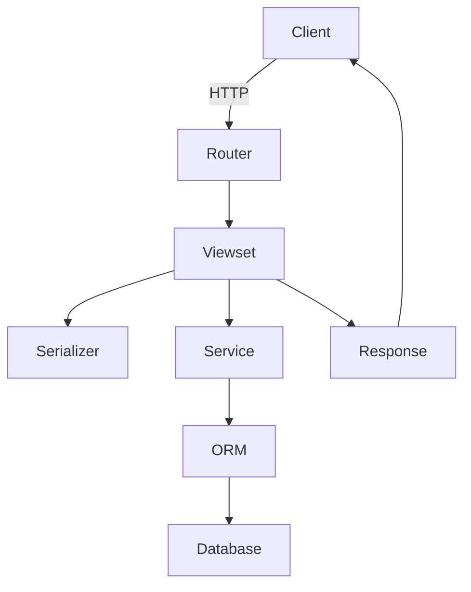
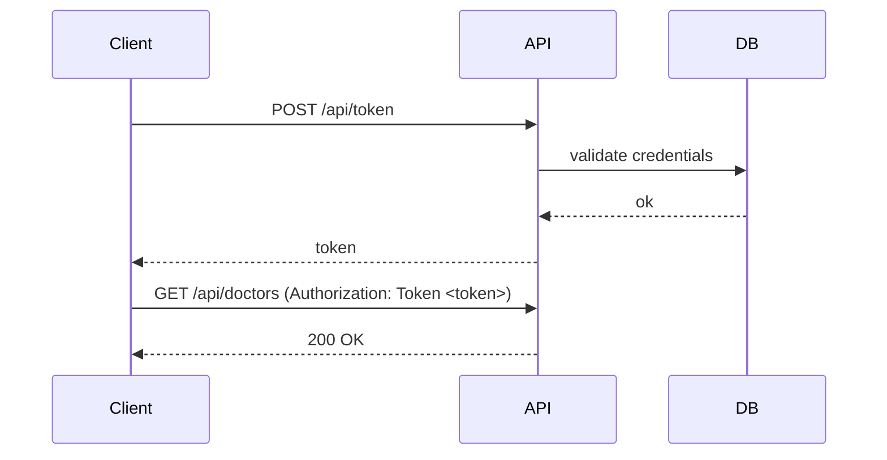
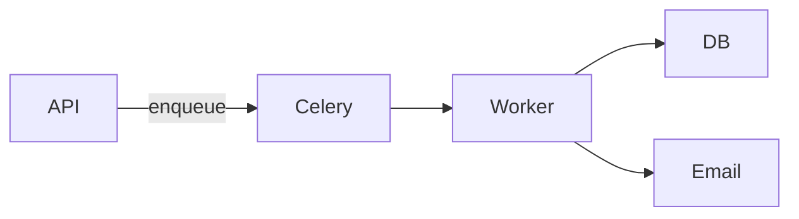
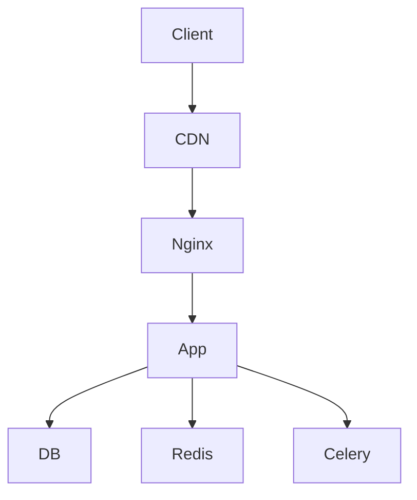

# Architecture and Diagrams

This chapter adds a professional architecture layer: project layout, request flow, and system boundaries.

## Step 1: Standard Project Layout

```
project/
├── config/
│   ├── settings.py
│   ├── urls.py
│   ├── wsgi.py
│   └── asgi.py
├── core/
│   ├── models.py
│   ├── serializers.py
│   ├── viewsets.py
│   ├── services.py
│   ├── selectors.py
│   └── urls.py
├── tests/
└── manage.py
```

## Step 2: Request Lifecycle



## Step 3: Service and Selector Pattern

Use `services.py` for writes and `selectors.py` for reads.

```python
# core/services.py
from .models import Doctor


def create_doctor(data):
    return Doctor.objects.create(**data)
```

```python
# core/selectors.py
from .models import Doctor


def get_active_doctors():
    return Doctor.objects.filter(is_active=True)
```

## Step 4: Auth Flow (Token)



## Step 5: Background Jobs



## Step 6: Deployment Topology



## Tips

- Keep views thin and move logic to services.
- Add a single place for query logic (selectors).
- Use diagrams to onboard new engineers quickly.

## Next Steps

- [Observability](./28-observability.md)
- [Performance](./29-performance.md)

---

[Previous: Django 6.0 Notes](./26-django-6-features.md) | [Back to Index](./README.md) | [Next: Observability](./28-observability.md)
